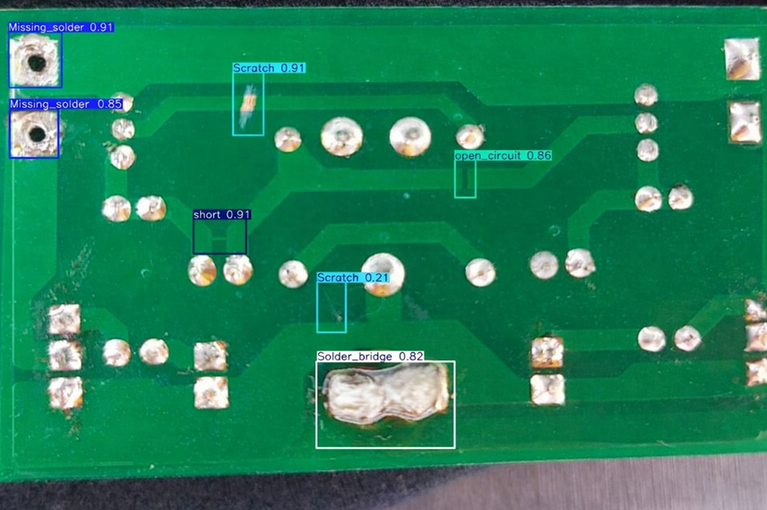
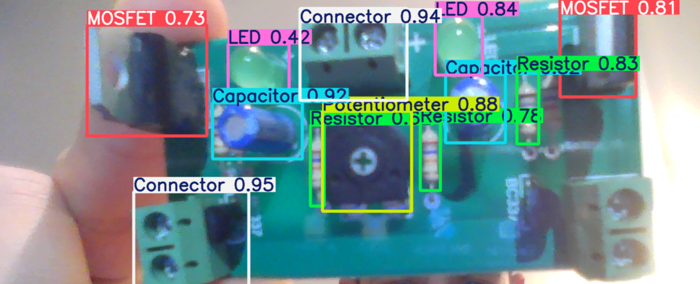

[Ana Sayfa](index.html) | **[Projelerim](projects.html)**
---

# Projelerim
## Derin Öğrenme Tabanlı Optik İnceleme ve Görsel Kusur Tespit Modülü
Modül, derin öğrenme mimarileri (YOLO) ve bilgisayarlı görü (OpenCV) tekniklerini kullanarak, PCB üzerindeki elektronik bileşenleri (direnç, diyot, MOSFET, entegre vb.) gerçek zamanlı olarak tanımlamak ve görsel kusurları otonom bir şekilde saptamayı amaçlamaktadır. Bu birim; eksik parça, yanlış dizilim, lehim köprüleri ve korozyon gibi fiziksel anomalileri yüksek çözünürlüklü görüntüler üzerinden analiz ederek, manuel gözle kontrol süreçlerini tamamen dijitalleştirmeyi ve hata tespitindeki insan faktörlü hata payını minimize etmeyi hedefler.  

Veri Seti Yönetimi ve Etiketleme: Modelin başarımı için özgün bir veri seti oluşturulmuş; PCB bileşenleri (direnç, diyot, entegre, MOSFET vb.) manuel olarak etiketlenerek yüksek doğruluklu bir eğitim havuzu hazırlanmıştır.  
  

Veri Artırımı (Data Augmentation): Modelin farklı ışık koşulları, perspektif açıları ve gürültü seviyelerinde kararlı çalışmasını sağlamak amacıyla; döndürme, parlaklık değişimi ve ölçeklendirme gibi artırım teknikleri uygulanarak modelin genelleme yeteneği (Robustness) optimize edilmiştir.  

YOLO ve OpenCV Entegrasyonu: Gerçek zamanlı nesne tespiti için YOLO mimarisi kullanılmış; kamera verileri OpenCV kütüphanesi ile ön işleme (gürültü giderme, kontrast iyileştirme) adımlarından geçirilerek analiz verimliliği en üst seviyeye taşınmıştır.  

Otonom Kusur Tespiti: Temassız analiz yöntemiyle; eksik parça, hatalı dizilim ve lehim anomalileri otonom olarak saptanarak teşhis süreci dijitalleştirilmiştir.  

-Sistem Performansı: Nesne Algılama ve Hata Saptama Verileri  

  

## CNC-Probe: 3 Eksenli Robot ile Termal ve Elektriksel PCB Analiz Cihazı  
Cihaz, 3 eksenli hareket edebilen robotik bir platform yardımıyla PCB üzerinde detaylı fiziksel kontroller gerçekleştirmeyi amaçlar. İlk aşamada yapay zekânın belirlediği şüpheli noktaları referans alarak kartı termal olarak haritalandırır; bu sayede çıplak gözle görülmeyen kısa devre ve aşırı ısınma bölgelerini anında saptar. Aynı zamanda otonom prob ucuyla otomatik elektriksel ölçümler yaparak, arızanın yerini milimetrik hassasiyetle belirler ve teşhis sürecini kesin bir raporla tamamlar.

  

-Projenin iş akış diyagramı

3 Eksenli Robotik Mekanizma: X, Y ve Z eksenlerinde hassas hareket kabiliyetine sahip CNC tabanlı bir sistem tasarlanmış; ölçüm probunun ve termal sensörün kart üzerindeki her noktaya otonom bir şekilde ulaşması sağlanmıştır.

Termal Haritalama ve Analiz: Entegre edilen kızılötesi sensör ile kartın yüzeyindeki ısı dağılımı dijital bir haritaya dönüştürülür. Bu haritalandırma sayesinde, normalden fazla ısınan bileşenler ve gizli kısa devre noktaları anlık olarak tespit edilir.

Otonom Prob ile Doğrulama: Yapay zeka modülü tarafından saptanan hata noktaları, görüntü düzlemindeki (piksel) konumlarından mekanik düzlemdeki (milimetrik) koordinatlara otomatik olarak dönüştürülür. Bu akıllı haritalandırma sayesinde termal sensör, kartın rastgele noktalarını taramak yerine doğrudan arıza şüphesi olan bileşenlerin üzerine konumlanır. Böylece, yapay zekanın "gördüğü" görsel hatalar, termal sensörün sunduğu "ısı verisi" ile saniyeler içinde fiziksel olarak doğrulanır.

## Düşük Genlikli Sinyaller için Yüksek SNR’li Amfi  
Bu proje, mikrofonlar veya düşük çıkışlı enstrüman manyetiklerinden gelen zayıf analog ses sinyallerini, devrenin kendi elektriksel ve termal gürültüsüne maruz bırakmadan optimum seviyeye yükselten yüksek performanslı bir ön yükseltici (pre-amplifier) tasarımıdır. Sistemin temel amacı, düşük gürültülü bileşenler ve hassas empedans eşleme teknikleriyle sesin doğal dinamiklerini korumak, maksimum sinyal-gürültü oranı (SNR) elde etmek ve böylece yüksek sadakatli (Hi-Fi) kayıt ile dinleme sistemleri için berrak, kayıpsız ve distorsiyonsuz bir ses altyapısı sunmaktır.

## Dinamik Yük Koşullarında Senkron Jeneratör Karakteristiklerinin MATLAB GUI ile İncelenmesi  
Bu interaktif MATLAB uygulaması, belirli bir senkron jeneratör probleminin değişken güç faktörü koşulları altındaki performans karakteristiklerini görselleştirmek ve analiz etmek amacıyla tasarlanmıştır. Bir kaydırma çubuğu (slider) yardımıyla güç faktörünü dinamik olarak ayarlayabilir; elektriksel parametrelerin (giriş torku, endüklenen tork, fazör diyagramı, verim, terminal gerilimi ve gerilim regülasyonu) ve sistem davranışının bu değişime nasıl tepki verdiğini gözlemleyebiliriz.  

[Çalışmanın youtube video kaydı](https://www.youtube.com/watch?v=nGcnPR7hnCM)

