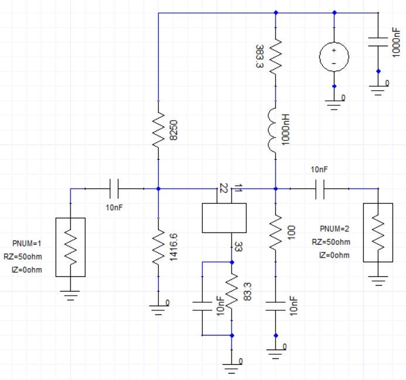

  <a href="index.html">Ana Sayfa</a> | 
  <strong><a href="projects.html">Projelerim</a></strong> | 
  <a href="en/projects.html">EN</a>

<h2 style="color: #2e81b7;">Derin Öğrenme Tabanlı Optik İnceleme ve Görsel Kusur Tespit Modülü</h2>

  Modül, derin öğrenme mimarileri (YOLO) ve bilgisayarlı görü (OpenCV) tekniklerini kullanarak, PCB üzerindeki elektronik bileşenleri (direnç, diyot, MOSFET, entegre vb.) gerçek zamanlı olarak tanımlamak ve görsel kusurları otonom bir şekilde saptamayı amaçlamaktadır. Bu birim; eksik parça, yanlış dizilim, lehim köprüleri ve korozyon gibi fiziksel anomalileri yüksek çözünürlüklü görüntüler üzerinden analiz ederek, manuel gözle kontrol süreçlerini tamamen dijitalleştirmeyi ve hata tespitindeki insan faktörlü hata payını minimize etmeyi hedefler.

  Veri Seti Yönetimi ve Etiketleme: Modelin başarımı için özgün bir veri seti oluşturulmuş; PCB bileşenleri manuel olarak etiketlenerek yüksek doğruluklu bir eğitim havuzu hazırlanmıştır.

  Veri Artırımı (Data Augmentation): Modelin farklı ışık koşulları ve perspektif açılarında kararlı çalışması amacıyla; döndürme, parlaklık değişimi ve ölçeklendirme teknikleri uygulanarak modelin genelleme yeteneği (Robustness) optimize edilmiştir.

  YOLO ve OpenCV Entegrasyonu: Gerçek zamanlı nesne tespiti için YOLO mimarisi kullanılmış; kamera verileri OpenCV kütüphanesi ile ön işleme adımlarından geçirilerek analiz verimliliği en üst seviyeye taşınmıştır.

  Otonom Kusur Tespiti: Temassız analiz yöntemiyle; eksik parça, hatalı dizilim ve lehim anomalileri otonom olarak saptanarak teşhis süreci dijitalleştirilmiştir.

<h4 style="color: #2e81b7;">- Sistem Performansı: Nesne Algılama ve Hata Saptama Verileri</h4>

<h2 style="color: #2e81b7;">CNC-Probe: 3 Eksenli Robot ile Termal ve Elektriksel PCB Analiz Cihazı</h2>

  Cihaz, 3 eksenli hareket edebilen robotik bir platform yardımıyla PCB üzerinde detaylı fiziksel kontroller gerçekleştirmeyi amaçlar. İlk aşamada yapay zekânın belirlediği şüpheli noktaları referans alarak kartı termal olarak haritalandırır; bu sayede çıplak gözle görülmeyen kısa devre ve aşırı ısınma bölgelerini anında saptar. Aynı zamanda otonom prob ucuyla otomatik elektriksel ölçümler yaparak, arızanın yerini milimetrik hassasiyetle belirler.

  
 

  

 

<h4 style="color: #2e81b7;">- Projenin İş Akış Diyagramı</h4>

<h4 style="color: #2e81b7;">- Sistem Çalışma Prensibi</h4>

  1. Eşzamanlı Görsel ve Termal Tarama: Yüksek çözünürlüklü optik kamera ve MLX90640 termal kamera, eşzamanlı çalışarak PCB'nin genel görüntüsünü ve ısı haritasını çıkarır.

  2. Yapay Zekâ ile Optik Analiz: Eğitilmiş YOLO modeli, optik görüntü üzerinden kartı tarayarak şüpheli bileşenlerin piksel koordinatlarını saptar.

  3. Termal Doğrulama ve Veri Çakıştırma: Saptanan şüpheli pikseller, termal harita üzerindeki bölgelerle eşleştirilir. Sıcaklık verisi analiz edilerek kısa devre veya aşırı ısınma durumu yazılımsal olarak doğrulanır.

  4. Mekanik Koordinat Dönüşümü: Onaylanan hatalı bölgenin piksel koordinatları, kalibrasyon matrisi (Homografi) kullanılarak CNC mekanizmasının gideceği milimetrik X-Y koordinatlarına çevrilir.

  5. Otonom Elektriksel Test: 3 eksenli kol, ölçüm probunu doğrudan hesaplanan bu koordinata yönlendirir ve fiziksel ölçümleri gerçekleştirir.

<h4 style="color: #2e81b7;">- Ölçüm Platform Karkası</h4>
  

  <a href="https://www.youtube.com/watch?v=8iHnph1PgWU" target="_blank">▶️ Projenin YouTube Video Kaydı</a>

<h2 style="color: #2e81b7;">Düşük Genlikli Sinyaller için Yüksek SNR’li Amfi</h2>

  Bu proje, zayıf analog ses sinyallerini, devrenin kendi gürültüsüne maruz bırakmadan optimum seviyeye yükselten yüksek performanslı bir ön yükseltici tasarımıdır. Temel amaç, düşük gürültülü bileşenlerle sesin doğal dinamiklerini korumak ve maksimum sinyal-gürültü oranı (SNR) elde etmektir.

  

<h2 style="color: #2e81b7;">Dinamik Yük Koşullarında Senkron Jeneratör Karakteristiklerinin MATLAB GUI ile İncelenmesi</h2>

  Bu interaktif MATLAB uygulaması, senkron jeneratör performans karakteristiklerini görselleştirmek amacıyla tasarlanmıştır. Slider yardımıyla güç faktörü ayarlanabilir; giriş torku, verim ve gerilim regülasyonu gibi parametrelerin değişimi anlık olarak gözlemlenebilir.

  

  <a href="https://www.youtube.com/watch?v=nGcnPR7hnCM" target="_blank">▶️ Çalışmanın YouTube Video Kaydı</a>

<h2 style="color: #2e81b7;">Kapsamlı İç Mekan Elektrik Tesisatı ve Yük Dağıtım Yönetimi</h2>

  Bu çalışma, modern bir konut yapısının elektrik altyapı gereksinimlerini mühendislik standartlarına uygun olarak ele alır. Mimari analiz, yük tahminleri ve teknik hesaplamaların entegrasyonuna odaklanarak güvenli ve verimli bir enerji dağıtım sistemi kurgulanmıştır.

<h4 style="color: #2e81b7;">- AutoCAD Ortamında Modellenen 2D Kat Planı</h4>

<h3 style="color: #2e81b7;">Gerçekleştirilen Teknik Çalışmalar</h3>  

Apartman dairesi mimari planı ve genel bina hiyerarşisi (katlar ve daireler dahil) AutoCAD ortamında teknik standartlara uygun olarak projelendirilmiştir. Tesisatın güvenli ve sürdürülebilir çalışması adına her bir hat (linye) için ayrı ayrı yüzde gerilim düşümü (%e) hesaplamaları gerçekleştirilmiştir. Sistemin enerji ihtiyacını, akım kapasitesini ve dengesini analiz etmek amacıyla uluslararası standartlarda bir Yük Tablosu oluşturulmuştur. Her oda için gerekli aydınlık düzeyini sağlamak amacıyla Zijl Metodu kullanılarak detaylı ışık kaynağı hesaplamaları yapılmış ve armatür yerleşimleri bu verilere göre tamamlanmıştır.  

<h4 style="color: #2e81b7;">- Güç Dağılımı ve Yük Tablosu Analizi</h4>

  Toplam kurulu güç 80.504 W olarak hesaplanmış; ancak sistemin gerçek zamanlı çalışma karakteristiğini yansıtmak amacıyla eşzamanlılık katsayısı (simultaneity factor) uygulanarak talep gücü 36.226,8 W seviyesine normalize edilmiştir.  
Konut içindeki yüksek güç tüketen ekipmanlar için özel linyeler tasarlanmıştır. Örneğin; 1. kat dairelerde yer alan çamaşır makinesi, bulaşık makinesi ve fırın gibi yüklerin yanı sıra bodrum katta yer alan araç şarj istasyonu hatları ayrı ayrı projelendirilmiştir.  
Ana dağıtım panosu için 63 A sigorta seçimi yapılmış; alt linyelerde ise yük tipine göre 10 A, 16 A ve 35 A değerlerinde koruma elemanları ve röleler konumlandırılmıştır.  
Ana besleme hattında %0.31 gibi düşük ve güvenli bir gerilim düşümü değeri elde edilerek sistem verimliliği tescil edilmiştir. 

  <a href="https://youtu.be/-xOm79f4XDA" target="_blank">▶️ Detaylı YouTube Video Kaydı</a>

