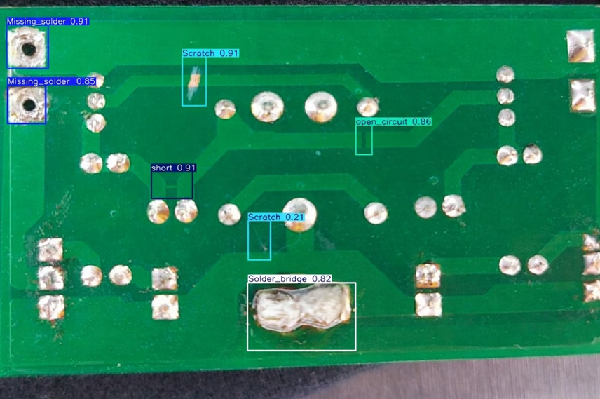
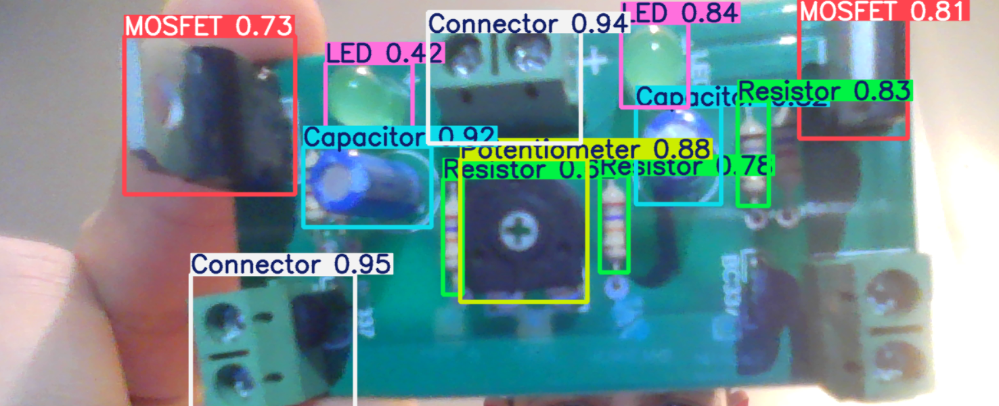
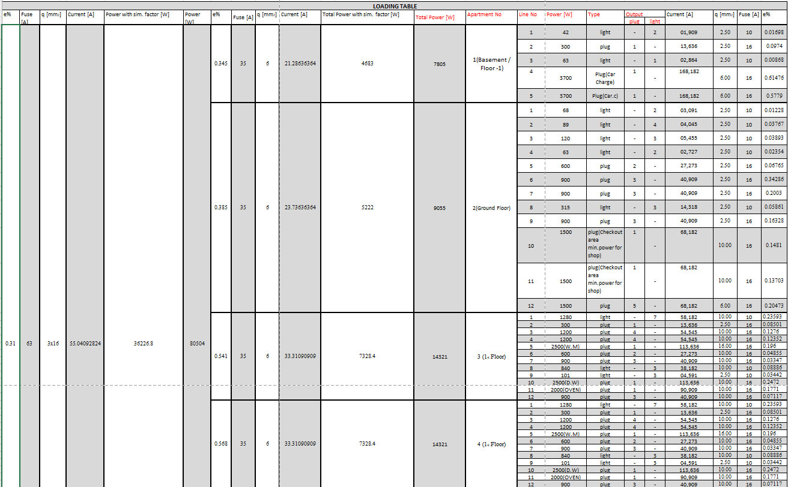

[Ana Sayfa](index.html) | **[Projelerim](projects.html)**
---

# Projelerim
## DERİN ÖĞRENME TABANLI OPTİK İNCELEME VE GÖRSEL KUSUR TESPİT MODÜLÜ
Modül, derin öğrenme mimarileri (YOLO) ve bilgisayarlı görü (OpenCV) tekniklerini kullanarak, PCB üzerindeki elektronik bileşenleri (direnç, diyot, MOSFET, entegre vb.) gerçek zamanlı olarak tanımlamak ve görsel kusurları otonom bir şekilde saptamayı amaçlamaktadır. Bu birim; eksik parça, yanlış dizilim, lehim köprüleri ve korozyon gibi fiziksel anomalileri yüksek çözünürlüklü görüntüler üzerinden analiz ederek, manuel gözle kontrol süreçlerini tamamen dijitalleştirmeyi ve hata tespitindeki insan faktörlü hata payını minimize etmeyi hedefler.  

Veri Seti Yönetimi ve Etiketleme: Modelin başarımı için özgün bir veri seti oluşturulmuş; PCB bileşenleri (direnç, diyot, entegre, MOSFET vb.) manuel olarak etiketlenerek yüksek doğruluklu bir eğitim havuzu hazırlanmıştır.  
  

Veri Artırımı (Data Augmentation): Modelin farklı ışık koşulları, perspektif açıları ve gürültü seviyelerinde kararlı çalışmasını sağlamak amacıyla; döndürme, parlaklık değişimi ve ölçeklendirme gibi artırım teknikleri uygulanarak modelin genelleme yeteneği (Robustness) optimize edilmiştir.  

YOLO ve OpenCV Entegrasyonu: Gerçek zamanlı nesne tespiti için YOLO mimarisi kullanılmış; kamera verileri OpenCV kütüphanesi ile ön işleme (gürültü giderme, kontrast iyileştirme) adımlarından geçirilerek analiz verimliliği en üst seviyeye taşınmıştır.  

Otonom Kusur Tespiti: Temassız analiz yöntemiyle; eksik parça, hatalı dizilim ve lehim anomalileri otonom olarak saptanarak teşhis süreci dijitalleştirilmiştir.  

#### -Sistem Performansı: Nesne Algılama ve Hata Saptama Verileri  

  

## CNC-Probe: 3 Eksenli Robot ile Termal ve Elektriksel PCB Analiz Cihazı  
Cihaz, 3 eksenli hareket edebilen robotik bir platform yardımıyla PCB üzerinde detaylı fiziksel kontroller gerçekleştirmeyi amaçlar. İlk aşamada yapay zekânın belirlediği şüpheli noktaları referans alarak kartı termal olarak haritalandırır; bu sayede çıplak gözle görülmeyen kısa devre ve aşırı ısınma bölgelerini anında saptar. Aynı zamanda otonom prob ucuyla otomatik elektriksel ölçümler yaparak, arızanın yerini milimetrik hassasiyetle belirler ve teşhis sürecini kesin bir raporla tamamlar.  

#### -Projenin İş Akış Diyagramı  

  

#### -Sistem Çalışma Prensibi  

1.Eşzamanlı Görsel ve Termal Tarama: Sabit konumlandırılmış yüksek çözünürlüklü optik kamera ve MLX90640 termal kamera, eşzamanlı olarak çalışarak tek seferde tüm PCB'nin genel görüntüsünü ve global ısı haritasını çıkarır.  

2.Yapay Zekâ ile Optik Analiz: Eğitilmiş YOLO modeli, optik görüntü üzerinden kartı tarayarak eksik, hatalı veya şüpheli bileşenlerin piksel koordinatlarını saptar.
Termal Doğrulama ve Veri Çakıştırma: Optik görüntüde saptanan şüpheli pikseller, genel termal harita üzerindeki ilgili bölgelerle eşleştirilir. O bölgedeki sıcaklık verisi analiz edilerek olası kısa devre veya aşırı ısınma durumu yazılımsal olarak doğrulanır.  

3.Mekanik Koordinat Dönüşümü: Optik ya da termal olarak onaylanan hatalı bölgenin piksel koordinatları, kalibrasyon matrisi (Homografi) kullanılarak CNC mekanizmasının gideceği milimetrik X-Y koordinatlarına çevrilir.  

4.Otonom Elektriksel Test: 3 eksenli kol, ucundaki ölçüm probunu doğrudan hesaplanan bu milimetrik koordinata yönlendirir ve bileşen üzerinde fiziksel voltaj/süreklilik ölçümlerini gerçekleştirir.  

5.Veri Füzyonu ve Raporlama: Optik tespit, termal ısı verisi ve elektriksel ölçüm sonuçları merkezi yazılım (PyQt5 GUI) üzerinde birleştirilerek kullanıcıya nihai arıza teşhis raporu sunulur.  

#### -Ölçüm Platform Karkası  
 

## Düşük Genlikli Sinyaller için Yüksek SNR’li Amfi  
Bu proje, mikrofonlar veya düşük çıkışlı enstrüman manyetiklerinden gelen zayıf analog ses sinyallerini, devrenin kendi elektriksel ve termal gürültüsüne maruz bırakmadan optimum seviyeye yükselten yüksek performanslı bir ön yükseltici (pre-amplifier) tasarımıdır. Sistemin temel amacı, düşük gürültülü bileşenler ve hassas empedans eşleme teknikleriyle sesin doğal dinamiklerini korumak, maksimum sinyal-gürültü oranı (SNR) elde etmek ve böylece yüksek sadakatli (Hi-Fi) kayıt ile dinleme sistemleri için berrak, kayıpsız ve distorsiyonsuz bir ses altyapısı sunmaktır.

## Dinamik Yük Koşullarında Senkron Jeneratör Karakteristiklerinin MATLAB GUI ile İncelenmesi  
Bu interaktif MATLAB uygulaması, belirli bir senkron jeneratör probleminin değişken güç faktörü koşulları altındaki performans karakteristiklerini görselleştirmek ve analiz etmek amacıyla tasarlanmıştır. Bir kaydırma çubuğu (slider) yardımıyla güç faktörünü dinamik olarak ayarlayabilir; elektriksel parametrelerin (giriş torku, endüklenen tork, fazör diyagramı, verim, terminal gerilimi ve gerilim regülasyonu) ve sistem davranışının bu değişime nasıl tepki verdiğini gözlemleyebiliriz.  

#### [Çalışmanın youtube video kaydı](https://www.youtube.com/watch?v=nGcnPR7hnCM)  

## Kapsamlı İç Mekan Elektrik Tesisatı ve Yük Dağıtım Yönetimi  
Bu çalışma, 'Illumination Techniques and Planning' dersi müfredatı dahilinde; modern bir konut yapısının elektrik altyapı gereksinimlerini mühendislik standartlarına uygun ve bütünsel bir yaklaşımla ele almak amacıyla hazırlanmıştır. Proje süreci; mimari gereksinimlerin analizi, yük tahminleri ve teknik hesaplamaların entegrasyonuna odaklanarak; güvenli, sürdürülebilir ve verimli bir enerji dağıtım sisteminin kurgulanması hedefiyle tamamlanmıştır. Akademik teorinin pratik mühendislik çözümleriyle bütünleştirildiği bu çalışma, teknik çizimlerden karmaşık güç analizlerine kadar tüm aşamaları kapsamaktadır.  

#### -AutoCAD Ortamında Modellenen 2D Elektrik Tesisat Kat Planı  

  

### Gerçekleştirilen Teknik Çalışmalar
Apartman dairesi mimari planı ve genel bina hiyerarşisi (katlar ve daireler dahil) AutoCAD ortamında teknik standartlara uygun olarak projelendirilmiştir. Tesisatın güvenli ve sürdürülebilir çalışması adına her bir hat (linye) için ayrı ayrı yüzde gerilim düşümü (%e) hesaplamaları gerçekleştirilmiştir. Sistemin enerji ihtiyacını, akım kapasitesini ve dengesini analiz etmek amacıyla uluslararası standartlarda bir Yük Tablosu oluşturulmuştur. Her oda için gerekli aydınlık düzeyini sağlamak amacıyla Zijl Metodu kullanılarak detaylı ışık kaynağı hesaplamaları yapılmış ve armatür yerleşimleri bu verilere göre tamamlanmıştır.  

#### -Güç Dağılımı ve Devre Karakteristikleri: Yük Tablosu Analizi  

  

Toplam kurulu güç 80.504 W olarak hesaplanmış; ancak sistemin gerçek zamanlı çalışma karakteristiğini yansıtmak amacıyla eşzamanlılık katsayısı (simultaneity factor) uygulanarak talep gücü 36.226,8 W seviyesine normalize edilmiştir.  

Konut içindeki yüksek güç tüketen ekipmanlar için özel linyeler tasarlanmıştır. Örneğin; 1. kat dairelerde yer alan çamaşır makinesi, bulaşık makinesi ve fırın gibi yüklerin yanı sıra bodrum katta yer alan araç şarj istasyonu hatları ayrı ayrı projelendirilmiştir.  

Ana dağıtım panosu için 63 A sigorta seçimi yapılmış; alt linyelerde ise yük tipine göre 10 A, 16 A ve 35 A değerlerinde koruma elemanları ve röleler konumlandırılmıştır.  

Ana besleme hattında %0.31 gibi düşük ve güvenli bir gerilim düşümü değeri elde edilerek sistem verimliliği tescil edilmiştir. 

#### [Çalışmaya Dair Detaylı Youtube Video Kaydı](https://youtu.be/-xOm79f4XDA)  

